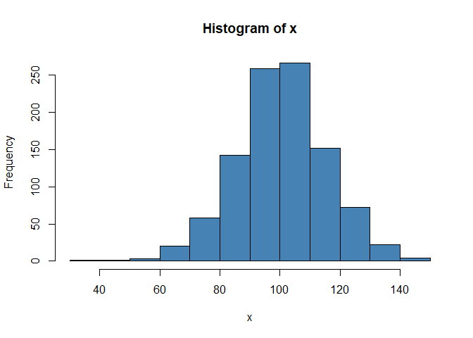

# Graphical Methods for Psychometric Model Selection using psketti 

This ReadMe details how to use materials in this repository. See
<https://github.com/SBGalvin/psketti> for more information on psketti.

## 01 Setup

1.  First go to the R website and download the latest version of
    [R](https://cran.r-project.org/bin/windows/).  
2.  Then go to the Rstudio link and download the latest **FREE** version
    of [Rstudio](https://rstudio.com/products/rstudio/download/)  
3.  Once the download has completed, open Rstudio
4.  Click File \> New Project…

</br> 

</br>

5.  Download the files from this repository
6.  Copy the repository files into your R project

## 02 Repository Structure

    Graphical-Methods-for-Psychometric-Model-Selection
    ├── R
    |   ├── 00-01_R-basics.R
    |   ├── 00-02_use-R-examples.R
    │   ├── 00-03_good-code-bad-code.R
    │   ├── 01_package-installs.R
    |   ├── 02_setup.R
    |   ├── 03_dRM.R
    |   └── 04_PCM.R
    ├── docs
    │   └── Graphical-Methods-for-Psychometric-Model-Selection.pdf
    └── ReadMe.md

### 02.1 R Code

All R code for this repository is stored in the R folder.
`R/01_package_installs.R` contains the code you need to install R
extension packages, including psketti. Example plots, similar to those
in the presentation slides, can be produced in `R/03_dRM.R`, which
contains an example **dichotomous Rasch Model**, and `R/04_PCM.R`, which
contains an example **Rasch Partial Credit Model**.

## 03 Using R

The extended primer is located in `R/00-01_R-basics.R`
`R/00-02_use_R_examples.R`, `R/00-03_good-code-bad-code.R`  
To run individual lines of code, place your mouse cursor in a code line
and press `ctrl+enter`

### Comments

Use comments to annotate code or block a line of code from running.
Place the `#` at the start of a line of code to comment or comment out.

``` r
# This is commented out, it will not run:
# x <- c(1, 2, 3, 4, 5)  # a numeric vector
# y
```

``` r
# This is NOT commented out, and it will run:
y   <- c(6, 7, 8, 9, 10) # a numeric vector
y # this should print to the output console
```

    ## [1]  6  7  8  9 10

### Help with functions

R packages are well documented. If you are a having an issue with using
a particular function type the code below and it will load the
documentation for that particular function. If you want to know what a
function does, place a question mark before it, and run.

``` r
# these will load the help document for a function:
?c        # concatenate things
?head     # help for the head() function
?mean     # help for the mean function
?sd       # help for the standard deviation function
?round    # rounds numbers
?paste0   # pastes things together
?rnorm    # produces a random sample
?hist     # produces histogram of input list
?summary  # summary values
```

### Variable Assignment

If we run a function without assignment, then it will not save in the
environment.

``` r
rnorm(n = 10, mean = 100, sd = 15)        # outputs directly to the console
```

    ##  [1]  93.24020  77.99301  83.29007  78.80562 115.15239  83.30422  90.79982
    ##  [8] 100.55956 106.64391  82.22702

We need to store the output in an object. This way, our output will save
to the environment and we can do things with it:

``` r
x <- rnorm(n = 1000, mean = 100, sd = 15) # sample 1000 values from a normal distribution
```

### Applying Functions to Objects

We can print the first 6 values of x directly to the console:

``` r
head(x, n = 6L) # show first n = 6 values ## (6L is integer 6)
```

    ## [1] 111.90547 118.49511  78.68794  88.96350  89.18858 123.08010

We can print a summary of x to the console:

``` r
summary(x) 
```

    ##    Min. 1st Qu.  Median    Mean 3rd Qu.    Max. 
    ##   49.44   90.08  100.17  100.25  110.37  141.28

We can produce a histogram of x, viewable in the plots pane:

``` r
hist(x, col = "steelblue")
```

<!-- -->

We can apply a function and save the output as an object…

``` r
x_hat    <- mean(x)  # mean
x_sd     <- sd(x)    # standard deviation
```

…and apply more functions to those objects:

``` r
# formatted and printed to the console
cat(paste0("Mean of x: ",
             round(x_hat, 2),
             "\n",
             "SD of x: ", round(x_sd, 2)))
```

    ## Mean of x: 100.25
    ## SD of x: 14.89
