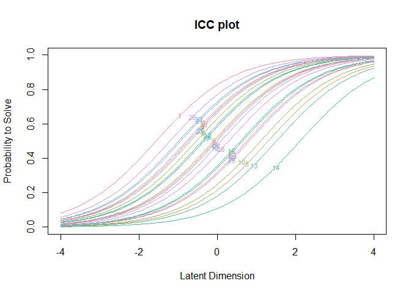

ReadMe
================

This ReadMe details how to use materials in this repository. Section 03
contains a Rasch model estimation primer.

## 01 Setup

1.  First go to the R website and download the latest version of
    [R](https://cran.r-project.org/bin/windows/).  
2.  Then go to the Rstudio link and download the latest **FREE** version
    of [Rstudio](https://rstudio.com/products/rstudio/download/)
3.  Copy the URL to this project repository
4.  Once the download has completed, open Rstudio
5.  Click File \> New Project…
6.  A window menu will open, Click \> Version Control \> Git
7.  Copy this repo URL into the repository URL box
8.  Select a directory on your device
9.  Click OK

<!-- end list -->

``` r
options(scipen = 999,
        stringsAsFactors = FALSE)
library(knitr)
library(kableExtra)
library(tidyverse)
```

    ## -- Attaching packages --------------------------------------------------------------------------------------------------- tidyverse 1.3.0 --

    ## v ggplot2 3.3.2     v purrr   0.3.4
    ## v tibble  3.0.3     v dplyr   1.0.1
    ## v tidyr   1.1.1     v stringr 1.4.0
    ## v readr   1.3.1     v forcats 0.5.0

    ## -- Conflicts ------------------------------------------------------------------------------------------------------ tidyverse_conflicts() --
    ## x dplyr::filter()     masks stats::filter()
    ## x dplyr::group_rows() masks kableExtra::group_rows()
    ## x dplyr::lag()        masks stats::lag()

``` r
library(eRm) # for Conditional Maximum Likelihood Estimation of Rasch Models
data(raschdat1)
```

## 02 R Code

All R code for this repository is stored in the R folder. To run
individual lines of code, place your mouse cursor in a code line and
press `ctrl+enter`

``` r
# This is commented out, it will not run:
# x <- c(1, 2, 3, 4, 5)  # a numeric vector
# This is NOT commentd out, and it will run:
y   <- c(6, 7, 8, 9, 10) # a numeric vector
y # this should print to the output console
```

    ## [1]  6  7  8  9 10

### Help with functions

R packages are well documented. If you are a having an issue with using
a particular function type the code below and it will load the
documentation for that particular function

``` r
# this will load the help document for a function:
?mean
?RM # for the eRm dichotomous Rasch Model
?psketto # for the psketti psketto function
```

## 03 Estimating a Rasch model with eRm

### Describe dataset

``` r
head(raschdat1) # view first 6 rows of dataset
```

    ##   I1 I2 I3 I4 I5 I6 I7 I8 I9 I10 I11 I12 I13 I14 I15 I16 I17 I18 I19 I20 I21
    ## 1  0  0  0  0  0  0  0  1  0   0   0   0   0   0   0   0   0   0   0   0   0
    ## 2  0  0  0  0  0  0  0  0  0   0   0   0   0   0   1   0   0   1   0   0   0
    ## 3  0  0  0  0  0  0  0  0  1   0   0   0   0   0   0   0   1   0   0   1   0
    ## 4  1  0  0  0  0  0  0  0  0   0   0   0   0   0   0   0   0   0   0   1   0
    ## 5  1  0  0  0  0  1  0  0  0   0   0   0   0   0   1   0   0   0   0   0   0
    ## 6  0  0  0  0  0  0  1  0  0   0   0   0   0   0   0   0   0   1   0   0   0
    ##   I22 I23 I24 I25 I26 I27 I28 I29 I30
    ## 1   0   0   0   0   0   0   0   0   0
    ## 2   0   0   0   0   0   0   0   0   0
    ## 3   0   0   0   0   0   0   0   0   0
    ## 4   1   0   1   0   0   0   0   0   0
    ## 5   0   0   1   0   0   0   0   0   0
    ## 6   0   0   1   0   0   0   0   0   1

``` r
RawScore <- rowSums(raschdat1)
hist(
  x = RawScore,
  main = "Histogram of Raw Scores",
  col = "steelblue"
)
```

<!-- -->

``` r
RawScore_Sumary <- tibble(N = length(RawScore),
       Mean = mean(RawScore),
       StDev = sd(RawScore),
       Min = min(RawScore),
       Max = max(RawScore))
RawScore_Sumary <- round(RawScore_Sumary, 2)

kable(RawScore_Sumary)
```

<table>

<thead>

<tr>

<th style="text-align:right;">

N

</th>

<th style="text-align:right;">

Mean

</th>

<th style="text-align:right;">

StDev

</th>

<th style="text-align:right;">

Min

</th>

<th style="text-align:right;">

Max

</th>

</tr>

</thead>

<tbody>

<tr>

<td style="text-align:right;">

100

</td>

<td style="text-align:right;">

13.97

</td>

<td style="text-align:right;">

6.01

</td>

<td style="text-align:right;">

1

</td>

<td style="text-align:right;">

26

</td>

</tr>

</tbody>

</table>

### Estimate Dichotomous Rasch Model

``` r
rm1 <- RM(raschdat1) # estimate the Rasch model
# summary(rm1) # view a summary of the object
```

### View the Item parameters

``` r
# View the difficulty parameters
# extract values from eRm object
Beta <- -coef(rm1)             # difficulty parameter
SE <- round(rm1$se.beta, 3)    # Standard Error of difficulty
Item <- names(coef(rm1))       # Item Names

Item <- gsub(pattern = "beta ", replacement = "", Item) # Clean up Item names

# break up the table into 3 columns per value (Item, Beta, SE) to view items
Item_Beta_df <- tibble(Item1 = Item[1:10],  Beta1 = round(Beta, 3)[1:10],  SE1 = SE[1:10],
                       Item2 = Item[11:20], Beta2 = round(Beta, 3)[11:20], SE2 = SE[11:20],
                       Item3 = Item[21:30], Beta3 = round(Beta, 3)[21:30], SE3 = SE[21:30])

# show table output:
kable(Item_Beta_df, 
      col.names = c("Item 1:10", "Beta 1:10", "SE 1:10",
                    "Item 11:20", "Beta 11:20", "SE 11:20",
                    "Item 21:30", "Beta 21:30", "SE 21:30"),
      caption = "Items and CML estimated Difficulty Parameters (Beta)",
      align = "rllrllrll")
```

<table>

<caption>

Items and CML estimated Difficulty Parameters (Beta)

</caption>

<thead>

<tr>

<th style="text-align:right;">

Item 1:10

</th>

<th style="text-align:left;">

Beta 1:10

</th>

<th style="text-align:left;">

SE 1:10

</th>

<th style="text-align:right;">

Item 11:20

</th>

<th style="text-align:left;">

Beta 11:20

</th>

<th style="text-align:left;">

SE 11:20

</th>

<th style="text-align:right;">

Item 21:30

</th>

<th style="text-align:left;">

Beta 21:30

</th>

<th style="text-align:left;">

SE 21:30

</th>

</tr>

</thead>

<tbody>

<tr>

<td style="text-align:right;">

I1

</td>

<td style="text-align:left;">

\-1.565

</td>

<td style="text-align:left;">

0.249

</td>

<td style="text-align:right;">

I11

</td>

<td style="text-align:left;">

0.650

</td>

<td style="text-align:left;">

0.228

</td>

<td style="text-align:right;">

I21

</td>

<td style="text-align:left;">

\-0.937

</td>

<td style="text-align:left;">

0.226

</td>

</tr>

<tr>

<td style="text-align:right;">

I2

</td>

<td style="text-align:left;">

\-0.051

</td>

<td style="text-align:left;">

0.216

</td>

<td style="text-align:right;">

I12

</td>

<td style="text-align:left;">

\-0.388

</td>

<td style="text-align:left;">

0.217

</td>

<td style="text-align:right;">

I22

</td>

<td style="text-align:left;">

\-0.989

</td>

<td style="text-align:left;">

0.227

</td>

</tr>

<tr>

<td style="text-align:right;">

I3

</td>

<td style="text-align:left;">

\-0.782

</td>

<td style="text-align:left;">

0.222

</td>

<td style="text-align:right;">

I13

</td>

<td style="text-align:left;">

1.511

</td>

<td style="text-align:left;">

0.267

</td>

<td style="text-align:right;">

I23

</td>

<td style="text-align:left;">

\-0.682

</td>

<td style="text-align:left;">

0.220

</td>

</tr>

<tr>

<td style="text-align:right;">

I4

</td>

<td style="text-align:left;">

0.650

</td>

<td style="text-align:left;">

0.228

</td>

<td style="text-align:right;">

I14

</td>

<td style="text-align:left;">

2.116

</td>

<td style="text-align:left;">

0.316

</td>

<td style="text-align:right;">

I24

</td>

<td style="text-align:left;">

\-0.003

</td>

<td style="text-align:left;">

0.217

</td>

</tr>

<tr>

<td style="text-align:right;">

I5

</td>

<td style="text-align:left;">

1.301

</td>

<td style="text-align:left;">

0.254

</td>

<td style="text-align:right;">

I15

</td>

<td style="text-align:left;">

\-0.340

</td>

<td style="text-align:left;">

0.216

</td>

<td style="text-align:right;">

I25

</td>

<td style="text-align:left;">

0.814

</td>

<td style="text-align:left;">

0.233

</td>

</tr>

<tr>

<td style="text-align:right;">

I6

</td>

<td style="text-align:left;">

\-0.099

</td>

<td style="text-align:left;">

0.216

</td>

<td style="text-align:right;">

I16

</td>

<td style="text-align:left;">

0.597

</td>

<td style="text-align:left;">

0.226

</td>

<td style="text-align:right;">

I26

</td>

<td style="text-align:left;">

\-1.207

</td>

<td style="text-align:left;">

0.234

</td>

</tr>

<tr>

<td style="text-align:right;">

I7

</td>

<td style="text-align:left;">

\-0.682

</td>

<td style="text-align:left;">

0.220

</td>

<td style="text-align:right;">

I17

</td>

<td style="text-align:left;">

\-0.340

</td>

<td style="text-align:left;">

0.216

</td>

<td style="text-align:right;">

I27

</td>

<td style="text-align:left;">

0.094

</td>

<td style="text-align:left;">

0.217

</td>

</tr>

<tr>

<td style="text-align:right;">

I8

</td>

<td style="text-align:left;">

\-0.732

</td>

<td style="text-align:left;">

0.221

</td>

<td style="text-align:right;">

I18

</td>

<td style="text-align:left;">

0.094

</td>

<td style="text-align:left;">

0.217

</td>

<td style="text-align:right;">

I28

</td>

<td style="text-align:left;">

0.290

</td>

<td style="text-align:left;">

0.220

</td>

</tr>

<tr>

<td style="text-align:right;">

I9

</td>

<td style="text-align:left;">

\-0.534

</td>

<td style="text-align:left;">

0.218

</td>

<td style="text-align:right;">

I19

</td>

<td style="text-align:left;">

0.759

</td>

<td style="text-align:left;">

0.231

</td>

<td style="text-align:right;">

I29

</td>

<td style="text-align:left;">

0.759

</td>

<td style="text-align:left;">

0.231

</td>

</tr>

<tr>

<td style="text-align:right;">

I10

</td>

<td style="text-align:left;">

1.108

</td>

<td style="text-align:left;">

0.245

</td>

<td style="text-align:right;">

I20

</td>

<td style="text-align:left;">

\-0.682

</td>

<td style="text-align:left;">

0.220

</td>

<td style="text-align:right;">

I30

</td>

<td style="text-align:left;">

\-0.732

</td>

<td style="text-align:left;">

0.221

</td>

</tr>

</tbody>

</table>

### Goodness of Fit Test

Model residuals are set to the χ² distribution, and if the
test-statistic is lower than an alpha criterion, then the model is
thought to not fit, requiring further investigation. For brevity, if the
one-sided χ² p value for the LR test is less than 0.05, or in the case
of the χ² distribution, greater than .95 then the items require further
investigation.

``` r
gg   <- data.frame(x=seq(0,75,0.1))
gg$y <- dchisq(gg$x,29)

ggplot(gg)+
  # chisquare theoretical
  geom_path(data = gg, aes(x,y)) +
  geom_ribbon(data=gg[gg$x<qchisq(.95,df = 29),],
              aes(x, ymin=0, ymax=y),
              fill="white",
              colour = 'black')+
  geom_ribbon(data=gg[gg$x>qchisq(.95,df = 29),],
              aes(x, ymin=0, ymax=y),
              fill="red",
              colour = 'black',)+
  ggtitle(expression(paste(chi[29]^{2}, "distribution")))+
  ylab("Density")+
  xlab(expression(chi[29]^{2}))+
  scale_x_continuous(limits = c(0, 75))+
  theme_minimal()
```

<!-- -->

Andersen’s Likelihood Ratio test subsets the sample into two groups,
estimates the Rasch model for each of these groups and compares the item
parameters. there should be a plausible reason for why model estimation
should differ between two groups, so a theoretical reason for splitting
the sample should be used rather than random splitting, if the work is
exploratory and there is no prior information to guide how the sample
should be split, then a median score split should be used for as opposed
to a random split. However, if the scores are not uniformly distributed,
then false positives (model rejection) are possible. In pracice, testing
the sample with multiple split criteria provides a good basis for
exploring model fit and all of the item parameter estimates should be
close to each other.

``` r
# Goodness of fit
LR1 <- LRtest(rm1, splitcr = "median") # Andersen Likelihood ratio test, compare model estimates between to subsets, using median split
# summary(LR1) view full summary
LR1 # view abbreviated output: Chi-square and p value
```

    ## 
    ## Andersen LR-test: 
    ## LR-value: 32.542 
    ## Chi-square df: 29 
    ## p-value:  0.297

### Goodness of fit plot

``` r
 # plot goodness of fit test: plots estimates from LR subsets
plotGOF(LR1, # LRtest object
        # add pearson correlation to title
        main = paste0("LR test. Beta Correlation between subsets: ", 
                      round(cor(LR1$betalist$high *-1, LR1$betalist$high *-1), 2)), 
        xlab = "Score <= Median", # x axis label
        ylab = "Score > Median")  # y axis label
```

<!-- -->

### Item Response Function (IRF)/ Item Characteristic Curve (ICC)

Plot all IRF. The IRF for each item are shown on a single plot. This
helps to identify the location of each item:i.e. How an items difficulty
is identified with its location on the x axis with:  
\- 0 being average difficulty  
\- Less than 0 being easier  
\- Greater than 0 being more difficult

``` r
plotjointICC(rm1, 
             legend = FALSE) # do not plot legend (too mny items)
```

<!-- -->

Plot IRF for single items. Where the 50% (.5) probability of a correct
response (y-axis) intersects with the IRF is the item difficulty
(location) for an item. This is denoted with blue dotted lines.

``` r
plotICC(rm1, item.subset = 1, empICC=list("raw"))            # Plot Item Response Function
abline(h = .5, col = "steelblue", lty = "dotted")            # y-axis location
abline(v = -coef(rm1)[1], col = "steelblue", lty = "dotted") # x-axis location
```

<!-- -->

``` r
plotICC(rm1, item.subset = 2, empICC=list("raw"))            # Plot Item Response Function
abline(h = .5, col = "steelblue", lty = "dotted")            # y-axis location
abline(v = -coef(rm1)[2], col = "steelblue", lty = "dotted") # x-axis location
```

<!-- -->

### Person Item Map

The person item map plots the overlap between the participant abilities
and the item difficulties. A well targetted test will show a substantial
overlap between the items and people.

``` r
plotPImap(rm1)
```

<!-- -->

``` r
ppar <- person.parameter(rm1)
tibble(Type = c(rep("Theta", 100), rep("Beta", 30)),
       Value = c(ppar$thetapar$NAgroup1, -coef(rm1) )) %>% 
  
  ggplot(aes(x = Value, fill = Type))+
  geom_histogram(alpha = .6, colour = 'white')+
  scale_fill_manual(values = c("steelblue", "tomato"), labels = c("Item", "People"), name = "")+
  xlab(expression(theta))+
  theme_minimal()+
  theme(legend.position = "bottom")
```

    ## `stat_bin()` using `bins = 30`. Pick better value with `binwidth`.

<!-- -->
